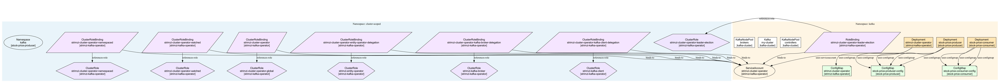

# Kafka Deployment Example

This example demonstrates how to deploy Apache Kafka to Kubernetes using kubeman with the [Strimzi Kafka Operator](https://github.com/strimzi/strimzi-kafka-operator).

## Overview

The example includes:
- **Strimzi Cluster Operator** for managing Kafka clusters via CRDs
- **Kafka cluster** with 3 broker replicas and 3 controller replicas for high availability
- **KRaft mode** (no Zookeeper required - uses Kafka's built-in Raft consensus)
- **Persistent storage** for both Kafka brokers and controllers
- **Resource limits** configured for production-like workloads
- **Stock Price Processing**: Producer and consumer services for processing live stock prices

### Resource Visualization

A detailed visualization of all Kubernetes resources and their relationships:



## Prerequisites

1. **kubectl** configured to access your Kubernetes cluster
2. **Helm** installed (version 3.x)
3. **kubeman** installed (see main README for installation instructions)
4. **Docker** installed (for building stock price producer/consumer images)

## Usage

### Render and Apply Manifests

The Kafka example includes automatic Docker image build steps for the stock price producer and consumer. When you run `kubeman render` or `kubeman apply`, build steps execute automatically, then templates are rendered to manifests, and for `apply`, manifests are applied to the cluster.

```bash
# From the examples/kafka directory:
cd examples/kafka
kubeman apply

# Or with explicit path from project root:
kubeman apply --file examples/kafka/kubeman.py

# For kind clusters, set Docker registry (optional, only needed for pushing images):
DOCKER_REGISTRY=us-central1-docker.pkg.dev/test-project/default \
  kubeman apply --file examples/kafka/kubeman.py

# Skip build steps if images are already built:
kubeman apply --file examples/kafka/kubeman.py --skip-build
```

**Note**: The `kubeman.py` file imports all template modules which automatically register themselves via the `@TemplateRegistry.register` decorator. Build steps execute automatically during registration, before rendering.

### Render Only (Without Applying)

To render manifests without applying them:

```bash
# From the examples/kafka directory:
cd examples/kafka
kubeman render

# Or with explicit path from project root:
kubeman render --file examples/kafka/kubeman.py

# Optionally specify custom output directory:
kubeman render --file examples/kafka/kubeman.py --output-dir ./custom-manifests
```

This builds the Docker images for producer and consumer (if not skipped) and renders all templates to the `manifests/` directory.

### Verify Deployment

Check the status of the Kafka deployment:

```bash
# Check pods (Kafka brokers, controllers, operator, Producer, Consumer)
kubectl get pods -n kafka

# Check services
kubectl get svc -n kafka

# Check persistent volume claims
kubectl get pvc -n kafka

# Check producer logs
kubectl logs -n kafka -l app=stock-price-producer

# Check consumer logs
kubectl logs -n kafka -l app=stock-price-consumer
```

## Configuration

The example is configured with:
- **Kafka broker replicas**: 3
- **Kafka controller replicas**: 3
- **Kafka broker storage**: 20Gi per pod
- **Kafka controller storage**: 10Gi per pod
- **Kafka broker resources**: 500m-2000m CPU, 1Gi-2Gi memory
- **Kafka controller resources**: 250m-1000m CPU, 512Mi-1Gi memory
- **Kafka version**: 4.1.0 (KRaft mode)

### Customizing the Configuration

Edit `kafka_example.py` and modify the `manifests()` method in the `KafkaCluster` class to customize replica counts, storage sizes, resource requests/limits, Kafka configuration (retention, segment size, etc.), listener configuration, and Kafka version.

## Accessing Kafka

### Internal Access (within cluster)

Kafka is accessible at `my-cluster-kafka-bootstrap.kafka.svc.cluster.local:9092` (port 9092, plain listener). The service name follows the pattern `{cluster-name}-kafka-bootstrap` where `my-cluster` is the Kafka cluster name defined in the CRD.

### Testing Kafka

Test Kafka using the built-in Kafka tools. First, get the name of a Kafka broker pod:

```bash
# Get Kafka broker pod name
KAFKA_POD=$(kubectl get pods -n kafka -l strimzi.io/cluster=my-cluster,strimzi.io/kind=Kafka,strimzi.io/name=my-cluster-kafka -o jsonpath='{.items[0].metadata.name}')

# Create a topic
kubectl exec -it $KAFKA_POD -n kafka -- kafka-topics.sh \
  --create \
  --bootstrap-server localhost:9092 \
  --replication-factor 3 \
  --partitions 3 \
  --topic test-topic

# List topics
kubectl exec -it $KAFKA_POD -n kafka -- kafka-topics.sh \
  --list \
  --bootstrap-server localhost:9092

# Produce messages
kubectl exec -it $KAFKA_POD -n kafka -- kafka-console-producer.sh \
  --bootstrap-server localhost:9092 \
  --topic test-topic

# Consume messages (in another terminal)
kubectl exec -it $KAFKA_POD -n kafka -- kafka-console-consumer.sh \
  --bootstrap-server localhost:9092 \
  --topic test-topic \
  --from-beginning
```

## Stock Price Processing

This example includes a complete stock price processing pipeline with producer and consumer services.

### Stock Price Producer

The producer service (`stock_price_producer.py`) fetches live stock prices from Yahoo Finance and publishes them to Kafka.

**Features:** Fetches prices for configurable stock symbols (default: AAPL, GOOGL, MSFT, TSLA), publishes JSON messages to Kafka topic `stock-prices`, configurable fetch interval (default: 5 seconds), and automatic retry on Kafka connection failures.

**Configuration:**
- `STOCK_SYMBOLS`: Comma-separated list of stock symbols
- `KAFKA_BROKER`: Kafka broker address (default: `my-cluster-kafka-bootstrap.kafka.svc.cluster.local:9092`)
- `KAFKA_TOPIC`: Kafka topic name (default: `stock-prices`)
- `FETCH_INTERVAL`: Seconds between price fetches (default: `5`)

**Message Format:**
```json
{
  "symbol": "AAPL",
  "price": 150.25,
  "timestamp": "2024-01-01T12:00:00Z"
}
```

### Stock Price Consumer

The consumer service (`stock_price_consumer.py`) consumes stock prices from Kafka and processes them.

**Features:** Consumes messages from the `stock-prices` topic, processes each message (logs by default, can be extended), consumer group coordination for scaling, and automatic offset management.

**Configuration:**
- `KAFKA_BROKER`: Kafka broker address
- `KAFKA_TOPIC`: Kafka topic name (default: `stock-prices`)
- `CONSUMER_GROUP`: Consumer group ID (default: `stock-price-processors`)

**Extending the Consumer:** The consumer can be extended to store prices to a database, calculate moving averages or other metrics, trigger alerts for price changes, aggregate statistics, or integrate with other systems.

### Creating the Kafka Topic

Before the producer can publish messages, create the topic:

```bash
# Get Kafka broker pod name
KAFKA_POD=$(kubectl get pods -n kafka -l strimzi.io/cluster=my-cluster,strimzi.io/kind=Kafka,strimzi.io/name=my-cluster-kafka -o jsonpath='{.items[0].metadata.name}')

# Create the stock-prices topic
kubectl exec -it $KAFKA_POD -n kafka -- kafka-topics.sh \
  --create \
  --bootstrap-server localhost:9092 \
  --replication-factor 3 \
  --partitions 3 \
  --topic stock-prices

# Verify topic was created
kubectl exec -it $KAFKA_POD -n kafka -- kafka-topics.sh \
  --list \
  --bootstrap-server localhost:9092
```

### Monitoring Stock Price Processing

```bash
# Watch producer logs
kubectl logs -n kafka -f -l app=stock-price-producer

# Watch consumer logs
kubectl logs -n kafka -f -l app=stock-price-consumer

# Check message count in topic
KAFKA_POD=$(kubectl get pods -n kafka -l strimzi.io/cluster=my-cluster,strimzi.io/kind=Kafka,strimzi.io/name=my-cluster-kafka -o jsonpath='{.items[0].metadata.name}')
kubectl exec -it $KAFKA_POD -n kafka -- kafka-run-class.sh \
  kafka.tools.GetOffsetShell \
  --bootstrap-server localhost:9092 \
  --topic stock-prices
```

### Customizing Stock Symbols

Edit the ConfigMap to change which stocks are tracked:
```bash
kubectl edit configmap stock-price-producer-config -n kafka
```

Or modify `stock_price_producer.py` and update the `STOCK_SYMBOLS` value in the ConfigMap.

## ArgoCD Integration (Optional)

To enable ArgoCD Application generation:

1. Set the `ARGOCD_APP_REPO_URL` environment variable:
   ```bash
   export ARGOCD_APP_REPO_URL="https://github.com/your-org/manifests-repo"
   ```

2. Modify `kafka_example.py` and set `enable_argocd()` to return `True`:
   ```python
   def enable_argocd(self) -> bool:
       return True
   ```

3. Render the manifests using `kubeman render` - an ArgoCD Application will be generated in `manifests/apps/kafka-application.yaml`

## Troubleshooting

### Pods not starting

Check pod logs:
```bash
# Check Strimzi operator logs
kubectl logs -n kafka -l name=strimzi-cluster-operator

# Check Kafka broker logs
kubectl logs -n kafka -l strimzi.io/cluster=my-cluster,strimzi.io/kind=Kafka,strimzi.io/name=my-cluster-kafka

# Check Kafka controller logs
kubectl logs -n kafka -l strimzi.io/cluster=my-cluster,strimzi.io/kind=Kafka,strimzi.io/name=my-cluster-controller

# Check producer and consumer logs
kubectl logs -n kafka -l app=stock-price-producer
kubectl logs -n kafka -l app=stock-price-consumer
```

### Producer not connecting to Kafka

Ensure Kafka is running and the broker address is correct:
```bash
# Check if Kafka pods are ready
kubectl get pods -n kafka

# Verify Kafka service
kubectl get svc -n kafka my-cluster-kafka-bootstrap

# Test connectivity from producer pod
kubectl exec -it -n kafka -l app=stock-price-producer -- \
  python -c "from kafka import KafkaProducer; p = KafkaProducer(bootstrap_servers=['my-cluster-kafka-bootstrap.kafka.svc.cluster.local:9092']); print('Connected!')"
```

### Consumer not receiving messages

Check if messages are being produced:
```bash
# Check producer logs for published messages
kubectl logs -n kafka -l app=stock-price-producer | grep Published

# Verify topic exists and has messages
KAFKA_POD=$(kubectl get pods -n kafka -l strimzi.io/cluster=my-cluster,strimzi.io/kind=Kafka,strimzi.io/name=my-cluster-kafka -o jsonpath='{.items[0].metadata.name}')
kubectl exec -it $KAFKA_POD -n kafka -- kafka-console-consumer.sh \
  --bootstrap-server localhost:9092 \
  --topic stock-prices \
  --from-beginning \
  --max-messages 10
```

### Storage issues

Verify persistent volume claims:
```bash
kubectl describe pvc -n kafka
```

### Network issues

Check services and endpoints:
```bash
kubectl get svc -n kafka
kubectl get endpoints -n kafka
```

## Further Reading

- [Strimzi Kafka Operator](https://github.com/strimzi/strimzi-kafka-operator) - Official Strimzi repository
- [Strimzi Documentation](https://strimzi.io/) - Official Strimzi documentation
- [Apache Kafka Documentation](https://kafka.apache.org/documentation/)
- [kubeman Documentation](../README.md)
